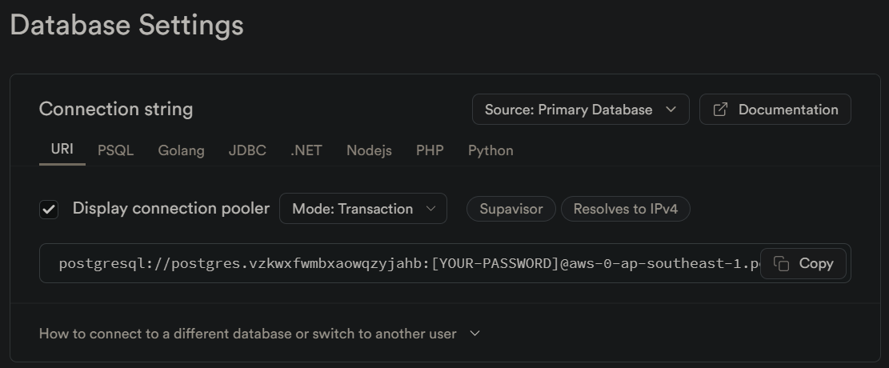
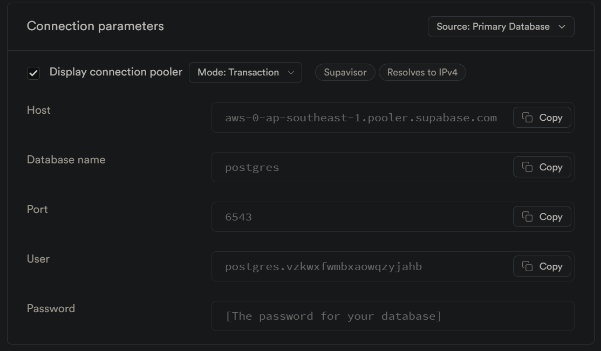

# Proyek Akhir: Menyelesaikan Permasalahan Perusahaan Edutech

## Business Understanding (Background)

Jaya Jaya Maju merupakan salah satu perusahaan multinasional yang telah berdiri sejak tahun 2000. Ia memiliki lebih dari 1000 karyawan yang tersebar di seluruh penjuru negeri. 

Walaupun telah menjadi menjadi perusahaan yang cukup besar, Jaya Jaya Maju masih cukup kesulitan dalam mengelola karyawan. Hal ini berimbas tingginya attrition rate (rasio jumlah karyawan yang keluar dengan total karyawan keseluruhan) hingga lebih dari 10%.

Untuk mencegah hal ini semakin parah, manajer departemen HR ingin meminta bantuan Anda mengidentifikasi berbagai faktor yang mempengaruhi tingginya attrition rate tersebut. Selain itu, ia juga meminta Anda untuk membuat business dashboard untuk membantunya memonitori berbagai faktor tersebut.


### Permasalahan Bisnis

<!-- Tuliskan seluruh permasalahan bisnis yang akan diselesaikan. -->
Berdasarkan deskripsi di atas, hal-hal yang menjadi tantangan maupun isu dalam manajemen karyawan di perusahaan Jaya Jaya Maju, saya menemukan beberapa hal berikut:

1. Tingginya Tingkat Attrition
    <p>Tingkat attrition di Jaya Jaya Maju melebihi 10%, yang berarti perusahaan kehilangan lebih dari 100 karyawan setiap tahun. Sehingga tingginya tingkat attrition dapat menimbulkan biaya besar terkait dengan rekrutmen, pelatihan, dan hilangnya produktivitas perusahaan. Jika tidak ditangani, tingginya tingkat attrition ini dapat mengakibatkan hilangnya orang yang berbakat di bidangnya, penurunan moral karyawan, dan reputasi perusahaan yang buruk.</p>

2. Kurangnya Pengembangan Karir
    <p>Karyawan mungkin merasa bahwa mereka tidak memiliki cukup peluang untuk berkembang dan maju dalam karir mereka di Jaya Jaya Maju. Kurangnya pengembangan karir dapat mengurangi motivasi dan komitmen karyawan terhadap perusahaan. Nah, tanpa kesempatan pengembangan karir yang jelas, perusahaan juga dapat berisiko kehilangan karyawan berbakat dan mencari peluang lebih baik di tempat lain.</p>

3. Kompensasi dan Penghargaan yang Tidak Kompetitif
    <p>Gaji dan tunjangan yang ditawarkan mungkin tidak sekompetitif perusahaan lain di industri yang sama. Karyawan yang merasa tidak dihargai secara finansial cenderung mencari pekerjaan lain dengan kompensasi yang lebih baik. Ketidakmampuan departemen HR untuk menarik dan mempertahankan talenta terbaik dapat membatasi kemampuan perusahaan untuk bersaing dan berkembang.</p>

4. Pengaruh Jarak Rumah - Perusahaan dan Komitmen Karyawan
    <p>Jarak antara rumah/tempat tinggal karyawan dan tempat kerja mungkin mempengaruhi tingkat kepuasan dan keinginan mereka untuk bertahan di perusahaan. Karyawan yang harus menempuh jarak jauh setiap hari mungkin mengalami kelelahan dan ketidakpuasan, yang dapat meningkatkan tingkat attrition. Jika tidak ada solusi untuk masalah ini, perusahaan mungkin terus kehilangan karyawan yang memilih bekerja lebih dekat dengan rumah/ tempat tinggal mereka.</p>


### Cakupan Proyek
<!-- Tuliskan cakupan proyek yang akan dikerjakan. -->

1. Pengumpulan dan Pemahaman Data:
    - Pada proyek ini datset sudah tersedia, terlampir link dataset pada sub dibawah.
    - Memahami struktur dan karakteristik data, termasuk jenis variabel, jumlah data, dan nilai-nilai yang hilang atau tidak valid.

2. Eksplorasi Data Analysis (EDA):
    - Melakukan eksplorasi data awal untuk mengidentifikasi pola, tren, dan hubungan antar variabel.
    - Visualisasi data untuk memahami distribusi variabel dan mendeteksi anomali atau outlier.

3. Pembersihan dan Persiapan Data:
    - Menangani nilai-nilai yang hilang, duplikat, atau tidak valid dalam dataset.
    - Mengonversi variabel-variabel yang diperlukan menjadi format yang sesuai untuk analisis lebih lanjut.
    - Normalisasi atau standarisasi variabel numerik.

4. Analisis Faktor-Faktor yang Mempengaruhi Attrition:
    - Melakukan analisis statistik untuk mengidentifikasi variabel-variabel yang paling signifikan mempengaruhi attrition.
    - Menggunakan teknik korelasi untuk menemukan hubungan antar variabel.

5. Pengembangan Model untuk memprediksi Employee Attrition:
    - Membagi dataset menjadi data latih dan data uji untuk pengembangan model prediksi.
    - Menggunakan resampling `SMOTE`, `RAndom Under Sampling` dan `Tanpa Resampling`
    - Membangun dan melatih model prediksi menggunakan algoritma machine learning. Model machine learning yang digunakan pada proyek ini:
        - random forest
        - logistic regression
        - decision tree
        - XGB
        - Gradien Boosting
        - SVM
    - Mengevaluasi performa model

6. Merancang dan membangun dashboard interaktif menggunakan `Metabase` yang terintegrasi dengan `Supabase`.

Dengan cakupan proyek yang sudah dijelaskan di atas, diharapkan dapat memberikan hasil yang komprehensif dan _actionable_ bagi Jaya Jaya Maju dalam mengurangi tingkat attrition dan meningkatkan manajemen karyawan.

### Persiapan

Sumber data: <a href="https://github.com/dicodingacademy/dicoding_dataset/tree/main/employee">Dataset Employee Jaya Jaya Maju</a> 


### Setup environment:

- Pastikan terhubung ke internet untuk dapat melakukan install module (library) 
- Buka cmd atau powershell as administrator

```bash
pip install -r requirements.txt
```

### Melakukan Upload Dataset ke Supabase

- Pastikan kamu sudah membuat akun <a href="https://supabase.com/dashboard/sign-in?">Supabase</a>.
- Jika sudah, klik `New Project`
- Kamu dapat mengisi form sesuai dengan keinginanmu, namun pastikan bahwa password mudah diingat atau perlu kamu salin di notepad.
- jika sudah kamu hanya perlu klik `Create New Project`. Tunggu sampai proses build selesai.
- Setelah itu klik Project Setting -> Database
- Lakukan copy Cennection String URL berikut.

    <!--  -->
    

- Paste pada notebook bagian `Mengupload dataset ke supabase`, ganti [Your Password] dengan password yang kamu masukkan tadi.
- Lakukan run notebook dari awal hingga bagian  `Mengupload dataset ke supabase`. Pastikan dapat berjalan dengan baik.

### Menghubungkan Database Supabase ke Metabase dengan Docker

- Pastikan kamu memiliki aplikasi <a href="https://www.docker.com/products/docker-desktop/" target="_blank">Docker</a> yang sudah terinstall atau kamu dapat melakukan install terlebih dahulu.
- Jika sudah terinstall. Run command berikut:
``` bash
docker run -p 3000:3000 --name metabase metabase/metabase
```
- Halaman browser baru akan terbuka. Kemudian Klik Settings -> Admin settings -> Database -> Add database
- Masukkan informasi konfigurasi dari database yang sebelumnya telah kamu buat.

    <!--  -->
    
- Jika sudah lengkap, klik `Save`.
- Kamu dapat membuat model, visualisasi dan dashboard sesuai keinginanmu.


## Run Steamlit Prediction Apps

Untuk menjalankan aplikasi ini, kamu harus masuk ke folder (_directory_) yang sesuai dengan file `prediction.py` berada, kemudian masukkan command berikut dan tekan Enter:
```bash
streamlit run prediction.py
```
 Atau akses secara online: <a href="https://employee-attrition-prediction-ml.streamlit.app/">HR - Employee Attrition Prediction App</a> 


### Fitur:

1. Melakukan prediksi dengan mengupload data karyawan dalam format `.csv`, sudah ada juga contoh file yang bisa kamu coba di `dataset/sample_test.csv`. Terdapat slider untuk mengatur banyaknya data yang ingin dipratinjau.
2. Pemilihan model machine learning yang memungkinkan _user_ dapat beriteraksi dengan aplikasi menjadi lebih baik.
3. Hasil prediksi dapat didownload dalam format `.csv` sehingga menjadi lebih mudah diakses.


## Business Dashboard

Dashboard ini menyajikan score card yang menampilkan metrik penting seperti jumlah karyawan, attrition rate, departemen, rata-rata masa kerja, dan metrik lainnya dari dataset karyawan Perusahaan Jaya Jaya Maju. Terdapat juga line chart yang menggambarkan tingkat atau jumlah attrition berdasarkan kelompok usia dan jarak rumah ke tempat kerja. Selain itu, dashboard ini menampilkan jumlah karyawan berdasarkan tingkat pendidikannya serta job satisfaction rating untuk semua job role. Terdapat juga pie chart yang menunjukkan perbandingan tingkat attrition berdasarkan gender, department, dan marital status. Dashboard ini juga dilengkapi dengan filter.

<iframe src="maulanakavaldo-video.mp4" frameborder="0" allowfullscreen></iframe>

## Conclusion

- Karyawan yang berusia 31-35 tahun memiliki tingkat attrition tertinggi, diikuti oleh kelompok usia 25-30 tahun sebagai yang kedua tertinggi. Hal ini mungkin menunjukkan bahwa karyawan dalam rentang usia ini mencari pengalaman baru atau gaji yang lebih baik sebagai motivasi untuk berpindah.
- Tingkat attrition lebih tinggi berada di departemen Sales dibandingkan dengan departemen lainnya.
- Jaraknya rumah ke tempat kerja tidak terlalu mempengaruhi tingginya tingkat attrition. Namun perusahaan perlu mempertimbangkan fleksibilitas jam kerja agar karyawan lebih betah dan nyaman dalam bekerja.
- Model machine learning Logistic Regression dan SVM tanpa resampling merupakan 2 model yang mempunyai tingkat stabilitas yang cukup baik dan akurasi yang tinggi. Sehingga kedua model tersebut digunakan sebagai acuan untuk melakukan prediksi data baru yang dapat dilakukan pada aplikasi prediksi Streamlit.


### Rekomendasi Action Items (Optional)

- Memberikan promosi kepada karyawan yang berusia 31-35 tahun yang memiliki kemampuan kerja yang baik.
- Bagian departemen Sales memiliki tingkat attrition yang tinggi, evaluasi kembali apakah perusahaan memberikan kendaraan inventaris yang cukup kepada karyawan yang sering melakukan perjalanan dinas. Jika mereka harus menggunakan kendaraan pribadi tentu hal ini memberatkan karyawan dan memilih untuk keluar dari perusahaan. Tentu tidak hanya sebatas ini, terdapat faktor lain seperti kondisi kendaraan yang dinventariskan, fasilitas dalam melakukan perjalanan dinas dan sebagainya.

- Perusahaan disarankan untuk meningkatkan akses dan kesadaran terhadap program pengembangan karir di semua tingkatan, dengan tujuan mempertahankan dan mengembangkan bakat internal serta meningkatkan kepuasan kerja secara keseluruhan.

- Pentingnya perusahaan Jaya Jaya Maju memberikan pengakuan atas prestasi karyawan untuk mempertahankan motivasi dan komitmen mereka.

- Perlunya untuk mempertimbangkan solusi seperti fleksibilitas jam kerja atau kebijakan kerja jarak jauh untuk mengurangi dampak negatif dari jarak tempuh yang jauh, yang dapat meningkatkan kepuasan dan retensi karyawan secara keseluruhan.

- Menyediakan fasilitas seperti ruang istirahat yang nyaman, gym, atau daycare. Sehingga karyawan dapat merilekskan diri sehingga tidak tegang dalam melakukan pekerjaan.
- Mengadakan acara dan kegiatan sosial untuk membangun rasa kebersamaan dan komunitas di antara karyawan. Hal ini dapat meningkatkan semangat dan motivasi karyawan.
